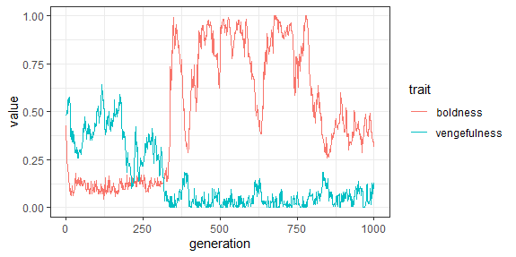
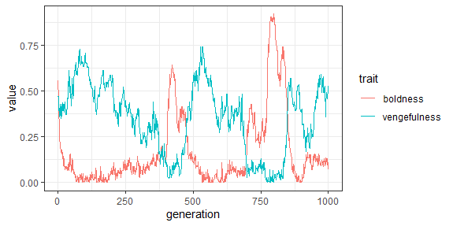

**Brief description of the verbal theory**

I implemented the concept of law enforcement into the norms game. I theorized that the distinctions between law enforcement and the penalties in the regular norms game are:

* Penalty for being caught by law enforcement is very large relative to penalty for being caught by another player.
* Law enforcement is much *less* likely to catch a violation.
* Law enforcement only applies to regular defection, not failures to punish.
* Law enforcement is done by a non-player, and is equally likely to catch everyone.

**Brief description of how you formalized it**

This was pretty simple. If a player chooses to defect, then there is a fixed probability that they will be caught by law enforcement and assign the law enforcement penalty. The parameter settings are critical to make this a reasonable model. I set the probability of being caught by law enforcement to 0.01, and the penalty to -100, roughly 11x the normal penalty.

**What did you learn?**

I wanted to see if law enforcement could create a stable norm without using metanorms.

I ran the simulation using the same parameters as Axelrod, but with no metanorm costs so that this was the regular norms game with law enforcement. With a probability of being caught of 0.01, I saw similar behavior to the regular norms game in most runs of the simulation.

One notable thing about the simulation behavior is that the norm-breaking high boldness doesn't stay super high across all generations once it sets in. 

I tried upping the probability of being caught to 0.015, which although it is still a small probability it should result in 50% more law-based punishments. 

Now I observed an interesting oscillatory behavior:

Here we see the same kind of pattern from the regular norms game, with low boldness creating low vengefullness, which in turn create high boldness. But the high boldness only lasts for a few dozen generations before vengefullness rises. This pattern seems to be cycling (though only 2 cycles are observed here). 

What might be the reason? I suspect that law enforcement can break the cycle of high boldness when more people are caught than is typical, just by chance. In most generations too few individuals are caught by law enforcement so boldness remains high. But every now and then there will be a generation where lots of players are caught and boldness is heavily penalized. This will cause less bold players to have a relatively higher fitness and redominate the game.

It would be interesting to see if this cyclical pattern is observed in any real-world law enforcement data. Are targeted periods of high enforcement successful at reducing norm-breaking behavior for a short period?

